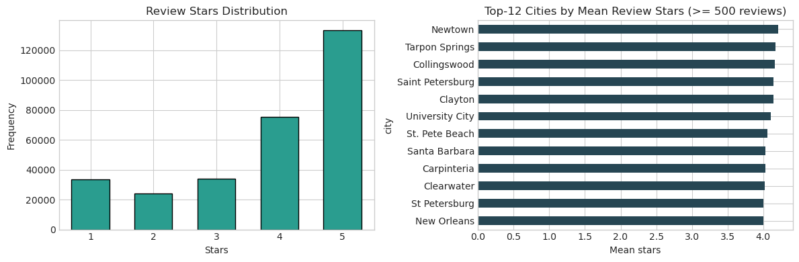
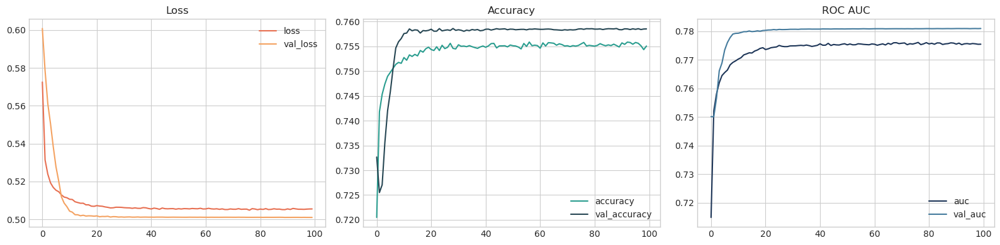

# Lab Report: SLURM part 1

**Name:** Robert Mesek  
**Lab:** 2  
**Date:** March 19, 2026

---

## Configuration of the Environment
<!-- lab02/commands.md -->
### Connect to the login node
```bash
ssh <login>@ares.cyfronet.pl
```

### Request an interactive session on the GPU node
```bash
srun --time=2:00:00 --mem=8G --ntasks 1 --gres=gpu:1 --partition=plgrid-gpu-v100 --account=plglscclass26-gpu --pty /bin/bash
```

### Locate the Yelp dataset in the shared storage
```bash
ls -lh $PLG_GROUPS_STORAGE/plgglscclass/yelp-dataset/
```

### Load necessary modules
```bash
module load miniconda3 sqlite
```

### Configure Conda environment
```bash
conda config --add envs_dirs ${SCRATCH}/.conda/envs
conda config --add pkgs_dirs ${SCRATCH}/.conda/pkgs
conda create -n lsclab python=3.13 jupyter -c conda-forge
conda activate lsclab
```

### Start Jupyter Notebook
```bash
jupyter notebook --no-browser --port=8888 --ip=$(hostname)
```
   
### Connect to the Ares node using SSH (for VSCode Remote-SSH), select the running Jupyter kernel, and start working on the data analysis

Check job status and reconnect if necessary
```bash
squeue --me
srun --jobid=<YOUR_JOBID> --overlap --pty /bin/bash
```

## Data Analysis
Short exploration and rating prediction on the Yelp dataset.

### Install necessary libraries and load the dataset
```python
%conda install -y -c conda-forge tensorflow numpy matplotlib scikit-learn pandas
```

### Import libraries and check TensorFlow and GPU availability
```python
# -- snip --
print("TensorFlow:", tf.__version__)
# -- snip --
print("GPU devices:", gpus if gpus else "none detected")
print("Data dir:", DATA_DIR)
```

Output
```
TensorFlow: 2.20.0
GPU devices: [PhysicalDevice(name='/physical_device:GPU:0', device_type='GPU')]
Data dir: /net/pr2/projects/plgrid/plgglscclass/yelp-dataset
```

### Check first few rows
|   |            business_id | stars_review | useful | funny | cool |                                              text | text_len | city         | state | stars_biz | review_count | is_open | categories                                        |   |
|--:|-----------------------:|-------------:|-------:|------:|-----:|--------------------------------------------------:|----------|--------------|-------|-----------|--------------|---------|---------------------------------------------------|---|
| 0 | XQfwVwDr-v0ZS3_CbbE5Xw | 3            | 0      | 0     | 0    | If you decide to eat here, just be aware it is... | 513      | North Wales  | PA    | 3.0       | 169          | 1       | Restaurants, Breakfast & Brunch, Food, Juice B... |   |
| 1 | 7ATYjTIgM3jUlt4UM3IypQ | 5            | 1      | 0     | 1    | I've taken a lot of spin classes over the year... | 829      | Philadelphia | PA    | 5.0       | 144          | 0       | Active Life, Cycling Classes, Trainers, Gyms, ... |   |
| 2 | YjUWPpI6HXG530lwP-fb2A | 3            | 0      | 0     | 0    | Family diner. Had the buffet. Eclectic assortm... | 339      | Tucson       | AZ    | 3.5       | 47           | 1       | Restaurants, Breakfast & Brunch                   |   |

### Quick exploration, e.g. shape, null checks, and high-level distributions

|              |    count |       mean |        std | min |   25% |   50% |   75% |    max |
|-------------:|---------:|-----------:|-----------:|----:|------:|------:|------:|-------:|
| stars_review | 300000.0 |   3.835867 |   1.361942 | 1.0 |   3.0 |   4.0 |   5.0 |    5.0 |
|    stars_biz | 300000.0 |   3.768218 |   0.679296 | 1.0 |   3.5 |   4.0 |   4.0 |    5.0 |
| review_count | 300000.0 | 386.602843 | 620.478799 | 5.0 |  59.0 | 167.0 | 430.0 | 4554.0 |
|      is_open | 300000.0 |   0.768293 |   0.421923 | 0.0 |   1.0 |   1.0 |   1.0 |    1.0 |
|     text_len | 300000.0 | 551.803377 | 505.511158 | 1.0 | 226.0 | 396.0 | 699.0 | 5000.0 |

|    Top cities |       |
|--------------:|------:|
|  Philadelphia | 51176 |
|   New Orleans | 34737 |
|     Nashville | 19524 |
|         Tampa | 16863 |
|        Tucson | 15363 |
| Indianapolis  | 15284 |
| Reno          | 13967 |
| Saint Louis   | 13950 |
| Santa Barbara | 11064 |
| Edmonton      | 4962  |

|            Top categories |        |
|--------------------------:|-------:|
|               Restaurants | 215621 |
|                      Food |  88291 |
|                 Nightlife |  70028 |
|                      Bars |  65643 |
|            American (New) |  49556 |
| American (Traditional)    | 42681  |
| Breakfast & Brunch        | 42159  |
| Event Planning & Services | 29857  |
| Sandwiches                | 29775  |
| Seafood                   | 24141  |

### Visualize the distribution of review ratings and Top-12 cities by most reviews


### Create a simple TensorFlow model to predict whether a review is high-rated (4+ stars).
```python
# -- snip --
callbacks = [
    tf.keras.callbacks.ReduceLROnPlateau(
        monitor="val_auc", 
        mode="max", 
        factor=0.5, 
        patience=4, 
        min_lr=1e-5, 
        verbose=1,
    ),
]

with tf.device(device_name):
    model = tf.keras.Sequential([
        tf.keras.layers.Input(shape=(X_train.shape[1],)),
        tf.keras.layers.Dense(256, activation="relu"),
        tf.keras.layers.BatchNormalization(),
        tf.keras.layers.Dropout(0.30),
        tf.keras.layers.Dense(128, activation="relu"),
        tf.keras.layers.BatchNormalization(),
        tf.keras.layers.Dropout(0.20),
        tf.keras.layers.Dense(64, activation="relu"),
        tf.keras.layers.Dense(1, activation="sigmoid"),
    ])

    model.compile(
        optimizer=tf.keras.optimizers.Adam(3e-4),
        loss="binary_crossentropy",
        metrics=[
            "accuracy",
            tf.keras.metrics.AUC(name="auc"),
            tf.keras.metrics.AUC(name="pr_auc", curve="PR"),
        ],
    )

    history = model.fit(
        X_train, y_train,
        validation_split=0.2,
        epochs=100,
        batch_size=4096,
        callbacks=callbacks,
        verbose=1,
    )
```

