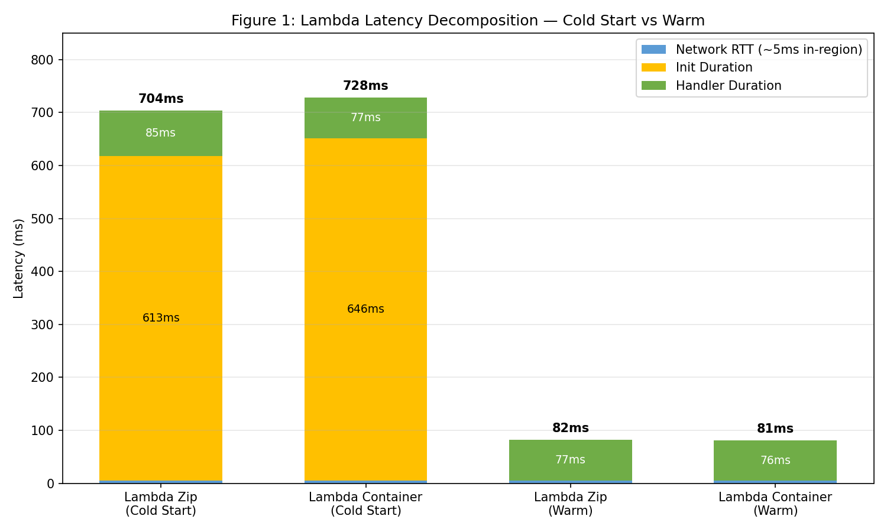
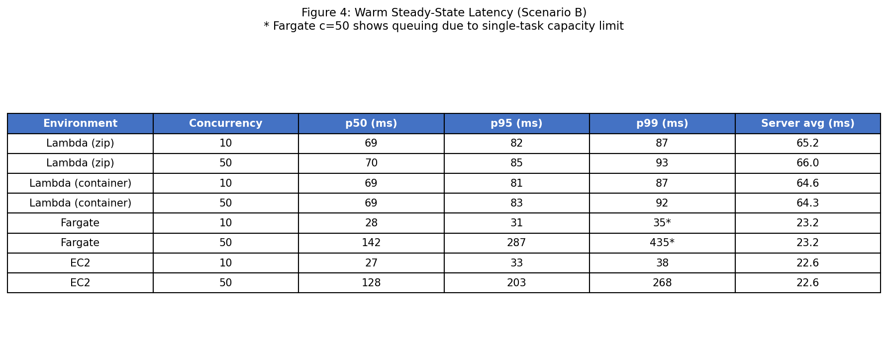
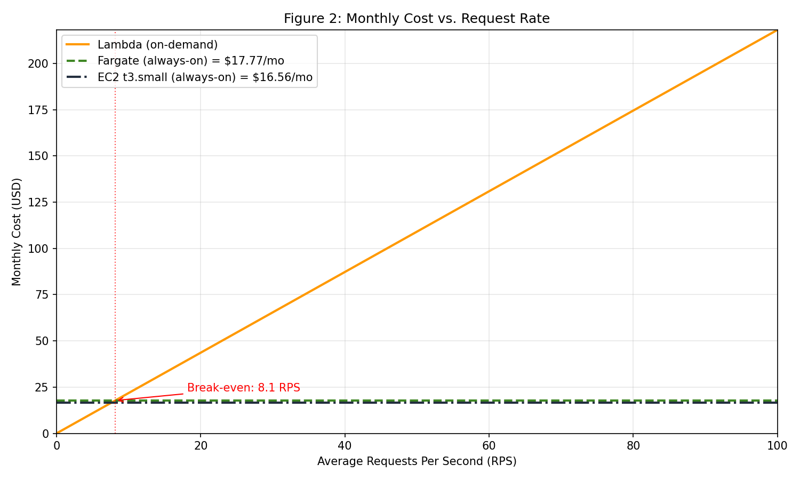
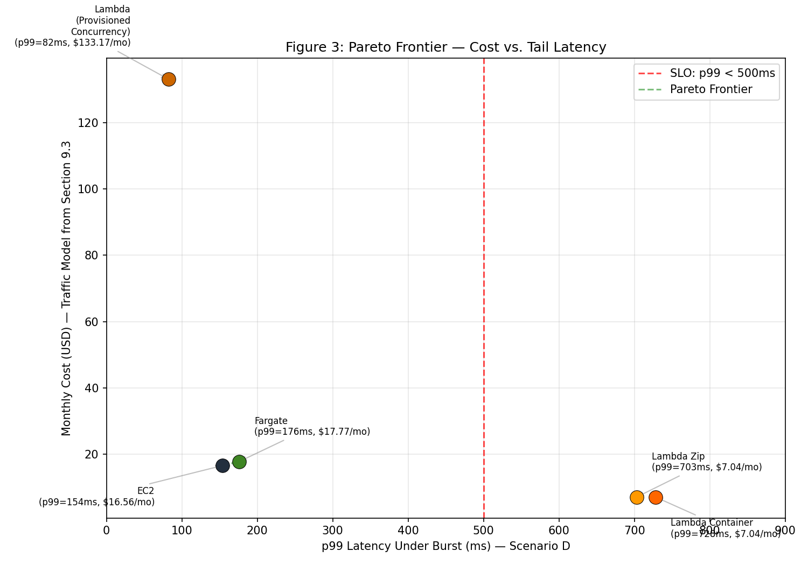

# Lab Report: AWS Cloud Lab - Serverless vs Containers

**Name:** Robert Mesek  
**Lab:** 4  
**Date:** April 10, 2026

---

## Assignment
Compare **AWS Lambda** (Zip & Container), **ECS Fargate**, and **EC2** using a k-NN search workload ($50,000$ vectors).
1. **Deploy** all four environments and verify identical results.
2. **Scenario A:** Measure and decompose cold start latency.
3. **Scenario B:** Measure warm steady-state throughput at varying concurrency.
4. **Scenario C:** Analyze performance during a "burst from zero" traffic spike.
5. **Cost Analysis:** Calculate idle costs and build a monthly cost model.
6. **Recommendation:** Provide a quantified infrastructure choice based on a p99 < 500ms SLO.

---

## Solution

### 1. Deployment Verification
All endpoints successfully deployed. Verification confirmed identical k-NN results:
* **Fargate/ALB:** Index `35859`, Distance `12.001459121704102`, Query Time `22.43 ms`.
* **EC2 Instance:** Index `35859`, Distance `12.001459121704102`, Query Time `33.598 ms`.

### 2. Scenario A: Cold Start Characterization
Cold starts are triggered when no warm execution environment is available. For Lambda, this includes **Init Duration** (microVM and runtime setup) and **Handler Duration**.

**Analysis:**
* **Zip vs. Container:** Lambda Zip cold starts (704ms) are slightly faster than Container cold starts (728ms) due to lower image pull/extraction overhead.
* **Warm Baseline:** Warm invocations drop to ~81-82ms total, as the ~600ms Init Duration is eliminated.

### 3. Scenario B: Warm Steady-State Throughput
Steady-state testing measures how environments handle sustained load and concurrency.

**Analysis:**
* **Scaling:** Lambda maintains stable latency at higher concurrency because it scales horizontally per request.
* **Queuing:** Fargate and EC2 show significantly higher p50/p99 at c=50 (142ms/435ms and 128ms/268ms) due to request queuing on a single-task capacity limit.

### 4. Scenario C: Burst from Zero
Simulating a traffic spike after 20 minutes of inactivity highlights the impact of cold starts on tail latency.

**Analysis:**
* **SLO Violation:** Under burst conditions, Lambda (Zip and Container) fails the p99 < 500ms SLO because the first requests trigger cold starts (p99 > 700ms).
* **Container Resilience:** EC2 and Fargate remain under 200ms p99 because the services are always warm and do not suffer from per-request provisioning delays.

### 5. Cost Analysis
Monthly costs vary between Lambda's per-request model and the "always-on" models of Fargate and EC2.

**Idle Cost (Monthly):**
* **Lambda:** $0.00 (Zero idle cost).
* **Fargate:** $17.77 (vCPU + RAM per hour).
* **EC2:** $16.56 (t3.small instance per hour).

**Break-Even Point:** Lambda remains the most cost-effective choice for low-traffic scenarios, with a break-even point at **8.1 average RPS**.

### 6. Final Recommendation

**Recommendation:** **EC2 t3.small** (or Fargate if serverless management is preferred).

* **Justification:** While Lambda is cheaper at low volumes, it fails the p99 < 500ms SLO during bursts due to cold starts. EC2 and Fargate provide the best balance of cost and performance (Pareto-optimal) while meeting the SLO.
* **Alternative:** To meet the SLO with Lambda, **Provisioned Concurrency** could be used, but this increases the monthly cost to ~$133.17, making it significantly more expensive than containerized options.
